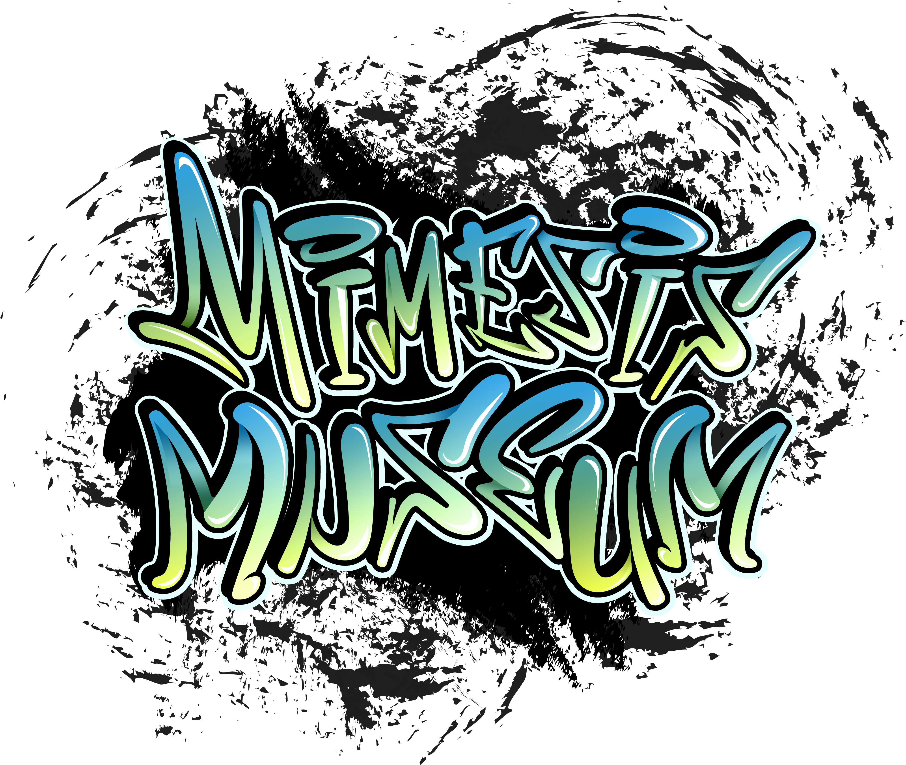

# MIMESIS - Jeu de stratégie en 2D

[](https://www.gnu.org/licenses/gpl-3.0)





## 📜 Table des matières
- [Comment Jouer ?](#🎮-Comment-Jouer-?)
- [Configuration requise](#⚙️-configuration-requise)
- [Architecture du projet](#🗂️-architecture-du-projet)
- [Méthodologie](#🔬-méthodologie)
- [Gestion des données](#💾-gestion-des-données)
- [Qualité & Tests](#🧪-qualité--tests)
- [Équipe](#👥-équipe)

## 🎮 Comment Jouer ?

### 📜 But

Mimesis est un jeu de stratégie en 2D dans lequel le joueur incarne un testeur de sécurité
chargé de dérober des œuvres d’art dans un musée virtuel tout en évitant les systèmes de
surveillance. Embauché par le directeur du musée Mimesis, votre mission est d'identifier
les vulnérabilités du musée sans vous faire attraper afin d’envoyer un rapport sur les points à
améliorer au dispositif de protection.

### ✍️ À savoir pour jouer

#
Touches par défaut en jeu :

Avancer        : Z
Reculer        : S
Aller à Gauche : Q
Aller à Droite : D
Intéragir      : F

#
Lors que vous êtes dans une partie et que vous souhaitez la quitter, la sauvegarder
ou encore modifier vos réglages, vous pouvez appuyer sur la touche "ECHAP"
de votre clavier pour faire apparaître le menu de pause et faire votre choix parmis :

- Reprendre la partie
- Modifier vos réglages
- Sauvegarder la partie
- Retourner au menu principal

#
Vous pouvez intéragir avec divers objets dans le musée tels que l'oeuvre exposée
ou encore le système de sécurité du musée. Pour ce faire, il vous suffit de vous
approcher de ces derniers jusqu'à voir une bulle apparaître avec la touche assignée
aux intéractions puis appuyer dessus.

#
Lors que vous appuyez sur "Jouer" via le menu principal, nous vous demandons de
renseigner votre pseudonyme afin de soit créer une partie, soit après avoir
appuyé sur la touche entrée de votre clavier sélectionner une des sauvegardes
associées à votre pseudonyme. Si vous souhaitez reprendre là où vous en étiez,
faites bien attention au numéro de partie attribuée à votre sauvegarde puis
cliquez sur cette dernière.

#
Une fois dans le menu de réglages, vous pouvez modifier l'attribution des touches,
il suffit de cliquer sur la touche à modifier puis d'appuyer sur la touche désirée.

Si vous souhaitez passer en mode fenêtré ou plein écran, vous pouvez appuyer sur
le bouton avec les 4 coins pour changer le mode.

## ⚙️ Configuration requise

### 🖥️ Systèmes d'exploitation
| Système		| Versions supportées			|
|---------------|-------------------------------|
| Windows		| 10 (21H2) • 11 (toutes)		|
| Linux			| Ubuntu 22.04 LTS				|

### 📦 Dépendances logicielles
```python
Python == 3.10.0
Pygame == 2.5.2
```

## 🗂️ Architecture du projet
voir `docs\structure.md` et autres documents dans `docs\`

## 🔬 Méthodologie

- Développé sous Windows/Linux avec Python 3.10
- Technologies clés :
	- **POO** pour les classes Salle/Touches/Arbre/Noeud
	- **SQLite** pour la persistance des données
	- **Arbre binaire** pour les choix narratifs

## 💾 Gestion des données
- Stockage des sauvegardes en tables SQL
- Pseudonymisation des données utilisateurs
- Plusieures parties pouvant être enregistrées par pseudos

### Structure de la base de données (sauvegarde.db)
voir `docs\`

## 🧪 Qualité & Tests
### Stratégie de test
| Type de test		| Couverture			| Outils				|
|-------------------|-----------------------|-----------------------|
| Intégration		| Scénarios complets	| Scripts custom		|
| Cross-platform	| Windows/Linux			| plusieurs ordinateurs	|

### ⚠️ Avertissements

- Lors de la phase de tests, nous nous sommes aperçu d'un problème lorsque
le programme est exécuté via IDLE, si vous souhaitez quitter le jeu via
le bouton "Quitter", le jeu va planter car IDLE va lancer en arrière plan
une fenêtre de confirmation de fermeture du programme. Tenez en compte
lorsque vous utilisez IDLE pour lancer le programme. Sinon, utilisez
une autre méthode.

- Evitez de changer de fenêtre une fois le programme lancé en mode plein écran,
cela peut être la cause d'une fermeture indésirable. Toute partie non sauvegardée
sera alors perdue.

### Vérifications
- Cohérence données/choix
- Gestion des erreurs SQL
- Bon fonctionnement via les interactions

## 👥 Équipe
| Membre			| Contact						|
|-------------------|-------------------------------|
| Paul MUNOZ		| paul.munozz14@gmail.com		|
| Joan GUILBERT		| joanguilbert18@gmail.com		|
| Noah LARZILLIÈRE	| noahlarzilliere73@gmail.com	|

#### Terminale Générale NSI - Institut Lemonnier - CAEN
#### Outils : VSCode - DB Browser

---
Ce projet est sous licence [GNU GPL v3+](LICENSE)

Ce fichier README a été généré le [2025-01-17] par [Paul MUNOZ].

Dernière mise-à-jour le : [2026-05-02].
