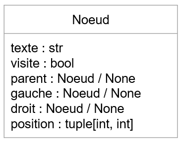
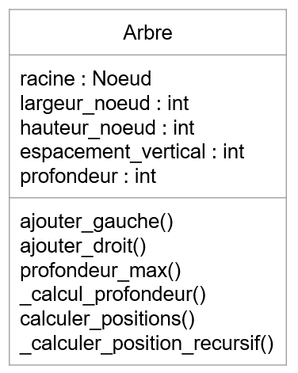
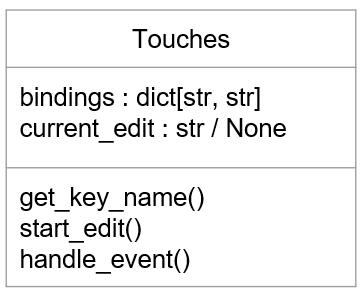
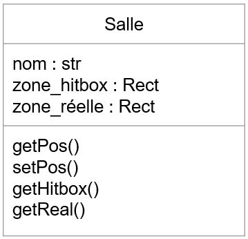
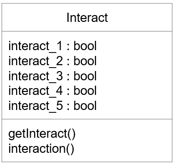
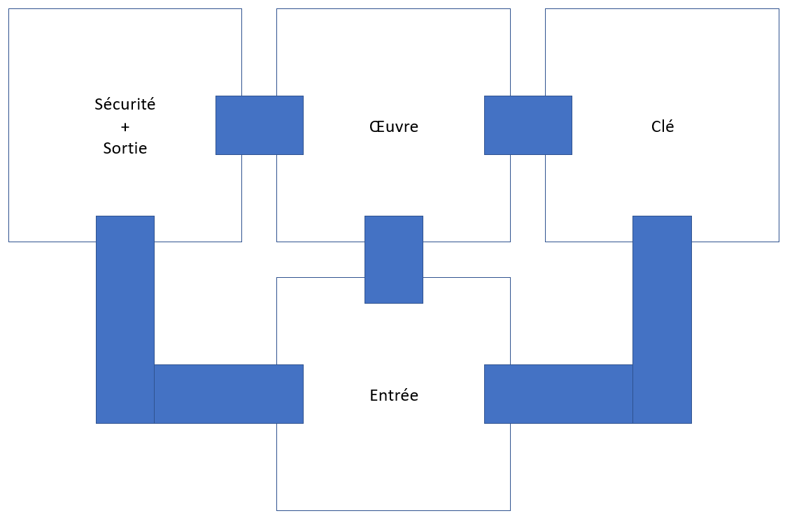
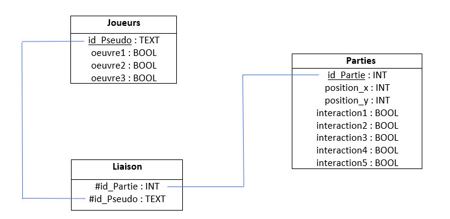
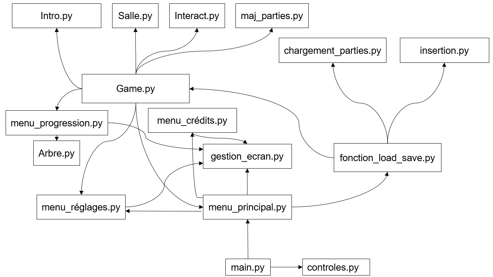
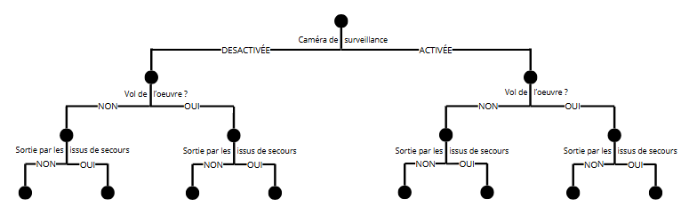

# 1. Structure du Projet Mimesis
```Python
Mimesis/
├── datas/              	# Données utilisées dans le programme
│   ├── LinLibertine_R.ttf			# Police Linux Libertine
│   ├── icone.ico					# Icone du programme
│   ├── wall.png					# Image de fond
│   ├── clé.png						# Image de la clé à récupérer en jeu
│   ├── titre.png					# Image du projet
│   ├── plan.png					# Plan du musée
│   ├── plan_no_cam.png				# Plan du musée avec caméras éteintes
│   ├── plan_no_all.png				# Plan du musée avec caméras éteintes et vase volé
│   ├── plan_no_vase.png			# Plan du musée avec vase volé
│   ├── player.png					# Image du joueur
│   ├── player_d.png				# Image du joueur en marchant avec le pied droit
│   ├── player_g.png				# Image du joueur en marchant avec le pied gauche
│   ├── sauvegarde.db				# Base de données des sauvegardes
│   ├── save_file.png				# Image lors du choix des différentes sauvegardes
│   ├── save_file_pressed.png		# save_file.png mais au survol
│   ├── sauvegarder.png				# Image du bouton sauvegarder
│   ├── sauvegarder_pressed.png		# sauvegarder.png mais au survol
│   ├── menu_principal.png			# Image du bouton du menu principal
│   ├── menu_principal_pressed.png	# menu_principal.png mais au survol
│   ├── nouvelle_partie.png			# Image du bouton de nouvelle partie
│   ├── nouvelle_partie_pressed.png	# nouvelle_partie.png mais au survol
│   ├── jouer.png					# Image du bouton jouer
│   ├── jouer_pressed.png			# jouer.png mais au survol
│   ├── quitter.png					# Image du bouton quitter
│   ├── quitter_pressed.png			# quitter.png mais au survol
│   ├── reprendre.png				# Image du bouton reprendre
│   ├── reprendre_pressed.png		# reprendre.png mais au survol
│   ├── retour.png					# Image du bouton de retour
│   ├── retour_pressed.png			# retour.png mais au survol
│   ├── réglages1.png				# Image du bouton des réglages dans le menu principal
│   ├── réglages1_pressed.png		# réglages1.png mais au survol
│   ├── réglages2.png				# Image du bouton des réglages dans le menu pause
│   ├── réglages2_pressed.png		# réglages2.png mais au survol
│   ├── progression.png				# Image du bouton progression
│   ├── progression_pressed.png		# progression.png mais au survol
│   ├── credits.png					# Image du bouton des credits
│   ├── credits_pressed.png			# credits.png mais au survol
│   ├── binding.png					# Image du bouton de configuration des touches
│   ├── binding_pressed.png			# binding.png mais au survol
│   ├── fullscreen.png				# Image du bouton pour passer en mode plein écran
│   ├── fullscreen_pressed.png		# fullscreen.png mais au survol
│   ├── windowed.png				# Image du bouton pour passer en mode fenêtré
│   └── windowed_pressed.png		# windowed.png mais au survol
├── docs/					# Documentation
│   ├── Arbre_binaire.png                       # Schéma de l'arbre binaire utilisée dans le jeu
│   ├── Diagramme_Arbre.png                     # Diagramme de la classe Arbre
│   ├── Diagramme_Interact.png                  # Diagramme de la classe Interact
│   ├── Diagramme_Noeud.png                     # Diagramme de la classe Noeud
│   ├── Diagramme_Salle.png                     # Diagramme de la classe Salle
│   ├── Diagramme_Touches.png                   # Diagramme de la classe Touches
│   ├── plan_musée.png                          # Schéma du musée
│   ├── schema_relationnel_base_de_données.png  # Schéma relationnel de la base de données sauvegarde.db
│   ├── structure.md                            # Fichier d'explication de la structure du programme
│   └── schema_fichiers.png                     # Schéma de la gestion des fichiers python
├── sources/				# Programmes python
│   ├── __pycache__/				# Dossier des fichiers compilés Python
│   ├── main.py						# fichier python principal
│   ├── controles.py				# Gestion des commandes
│   ├── arbre.py					# Système d'arbre décisionnel
│   ├── chargement_parties.py		# Chargement des parties sauvegardées
│   ├── crée_tables.py				# Création des tables de la base de données
│   ├── fonction_load_save.py		# Fonction de gestion des sauvegardes
│   ├── Game.py						# Gestion principale du jeu
│   ├── gestion_ecran.py            # Gestion du mode plein écran et fenêtré du jeu
│   ├── insertion.py				# Insertion de données dans la base de données
│   ├── Interact.py					# Gestion des interactions dans le jeu
│   ├── Intro.py					# Gestion de l'introduction
│   ├── maj_tables.py				# Mise à jour des tables de la base de données
│   ├── menu_crédits.py				# Affichage du menu des crédits
│   ├── menu_principal.py			# Affichage du menu principal
│   ├── menu_progression.py			# Affichage du menu de progression
│   ├── menu_réglages.py			# Affichage du menu des réglages
│   └── Salle.py					# Gestion des salles du jeu
├── licence.txt			# Licence du programme
├── presentation.pdf	# Présentation du programme
├── README.md			# fichier README du programme
└── requirements.txt	# Bibliothèques python nécessaires
```

# 2. Architecture Logicielle

## 2.1 Module d'Affichage des menus (`sources\menu_[nom_du_menu].py`)
```markdown
- Gestion de l'interface avec Pygame
- Système de menus dynamiques (principal, options, crédits)
- Mécanisme de boutons interactifs avec états actif/inactif
- Gestion du plein écran/fenêtré
```

## 2.2 Arbre des Décisions (`sources\arbre.py`)



## 2.3 Gestion des Contrôles (`sources\controles.py`)


## 2.4 Gestion des Salles (`sources\Salle.py`)


## 2.5 Gestion des Interactions (`sources\Interact.py`)


## 2.6 Plan du musée (`docs\plan_musée.png`)


## 2.7 Gestion de la base de donnée (`datas\sauvegarde.db`)


## 2.8 Gestion des fichiers python (`sources\`)


# 3. Points Clés de Développement

## 3.1 Structure de l'Arbre Binaire
- Implémentation personnalisée sans librairie externe
- Méthode récursive pour le calcul des positions
- Marquage des nœuds visités pour la progression

## 3.2 Système de Menus Dynamique
- Redimensionnement automatique des éléments
- Gestion des états de clic et de positionnement de la souris

## 3.3 Gestion des Contrôles
- Système de reconfiguration à chaud des touches
- Mapping clé physique -> nom logique

# 4. Schémas Relationnels
## Structure de l'Arbre de Décisions


# 5. Pour étendre le projet :

1. Ajouter des nœuds à l'arbre : Modifier `menu_progression()`
2. Nouveaux menus : Copier le pattern de des fichiers `menu_[nom_du_menu]`, vous avez différents exemples selon les menus
3. Nouveaux contrôles : Étendre la classe `Touches`

## Bonnes pratiques :
- Respecter les ratios d'espacement dynamique (pourcentages)
- Utiliser `DATA_DIR` pour les chemins de ressources
- Tester les changements avec `tests\run_tests.py`